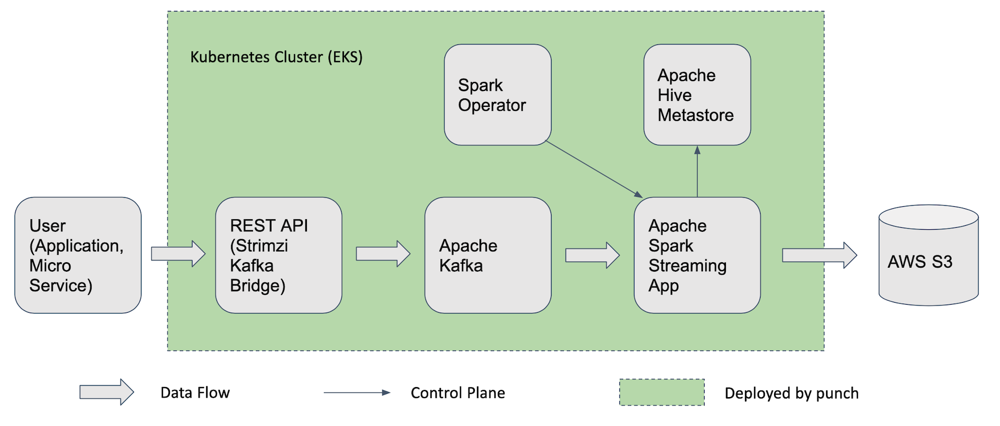

## Introduction

This project provides a fully automated one-click tool to create Data Analytics platform in Cloud and Kubernetes environment:

1. Single script to deploy a full stack data platform: Kafka, Hive Metastore, Spark, and Data Ingestion Job.

2. Spark API Gateway to run Spark platform as a service.

3. Extensible design to support customization and new service deployment.

## Use Cases

### Deploy Spark as a Service on EKS

Use command like `punch install SparkOnEks` to get a ready-to-use Spark Service within minutes. That single
command will do following automatically:

1. Create an AWS EKS cluster and set up required IAM roles
2. Deploy Nginx Ingress Controller and a Load Balancer
3. Deploy Spark Operator and a REST API Gateway to accept application submission
4. Deploy Spark History Server
5. Enable Cluster AutoScaler

When the `punch` command finishes, the Spark Service is ready to use. People could use `curl` or the command line 
tool (`sparkcli`) to submit Spark application.

### Deploy a Data Ingestion Platform

`punch` also supports chaining multiple `install` commands to deploy a complex data platform.

For example, we could create a single script file with multiple commands:

```
punch install Eks -> punch install KafkaBridge -> punch install HiveMetastore -> punch install SparkOnEks
```

The script will deploy a data ingestion platform with all the components in the green area in the following diagram:



After it is deployed, user could send data to the REST API. Then the data will get into Kafka and automatically 
ingested into AWS S3 by the Spark Streaming application. People could write further Spark applications to query 
Hive table or compute metrics/insights from the table.

## How to build (on MacBook)

The following command will create `dist` folder and `dist.zip` file for Punch.

```
make release
```

Go to `dist` folder, check [User Guide](UserGuide.md) to see how to run `punch` command.


## User Guide - Run Spark on AWS EKS

Again, use one command like `punch install SparkOnEks` to deploy a runnable Spark environment on EKS.

See [User Guide](UserGuide.md) for more details in section: `Run punch on AWS`.


---
Thanks for support from [JetBrains](https://jb.gg/OpenSourceSupport) with the great development tool and licenses.
