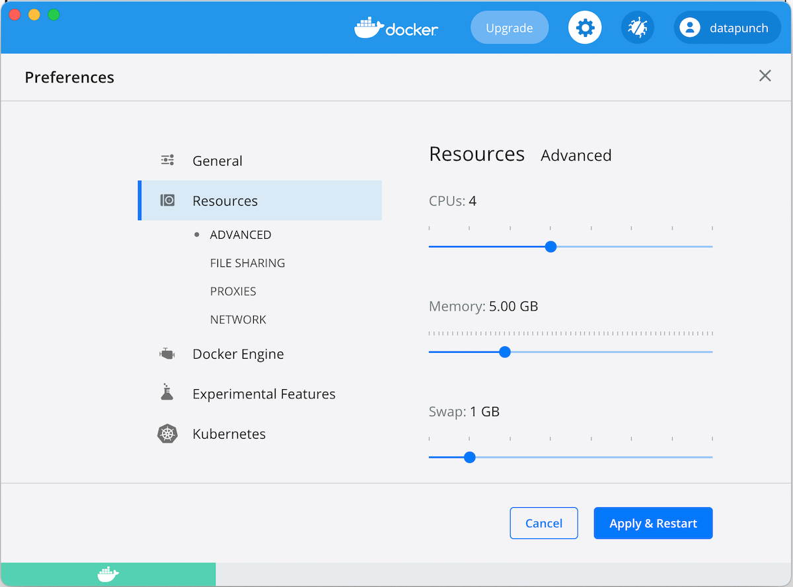

## Note

You may hit insufficient memory issue when starting minikube with more memory, like following:

```
❌  Exiting due to MK_USAGE: Docker Desktop has only 1985MB memory but you specified 4096MB
```

To fix this issue, you could increase memory for `Docker Desktop`. See following for steps.

## How to Increase Memory for Docker Desktop

1. Click `Docker Desktop` icon and choose `Preferences...` in the menu:


2. Click `Resources`, and adjust memory to 5GB:



